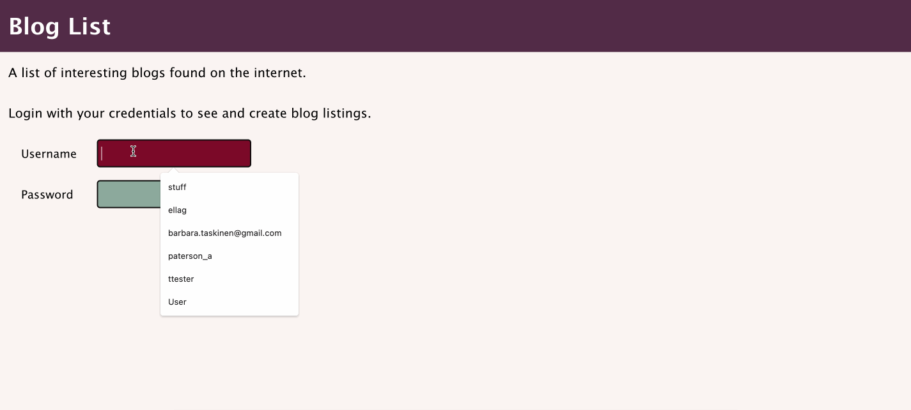

# Blog List

This React app allows users to add their favorite blog entries to a list. User must be logged in to be able to add and like blogs. Only the user who added a blog can delete the blog. Users can leave annonymous comments to each blog listing.

The Node.js Express server connects the app to a MongoDB database.

